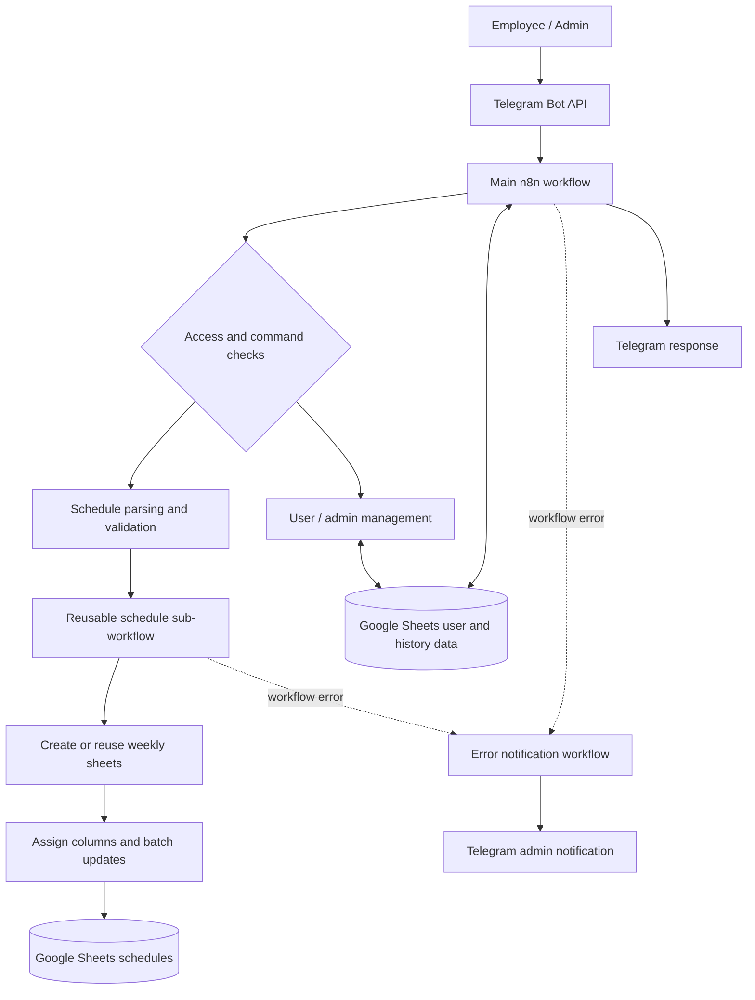

# Architecture overview

```mermaid
flowchart TD
    A[Employee / Admin] --> B[Telegram Bot API]
    B --> C[Main n8n workflow]
    C --> D{Access and command checks}
    D --> E[Schedule parsing and validation]
    D --> F[User / admin management]
    E --> G[Reusable schedule sub-workflow]
    G --> H[Create or reuse weekly sheets]
    H --> I[Assign columns and batch updates]
    I --> J[(Google Sheets schedules)]
    C <--> K[(Google Sheets user and history data)]
    F <--> K
    C -. workflow error .-> L[Error notification workflow]
    G -. workflow error .-> L
    L --> M[Telegram admin notification]
    C --> N[Telegram response]
```

Conceptual overview only. Some operational details are deliberately omitted.
